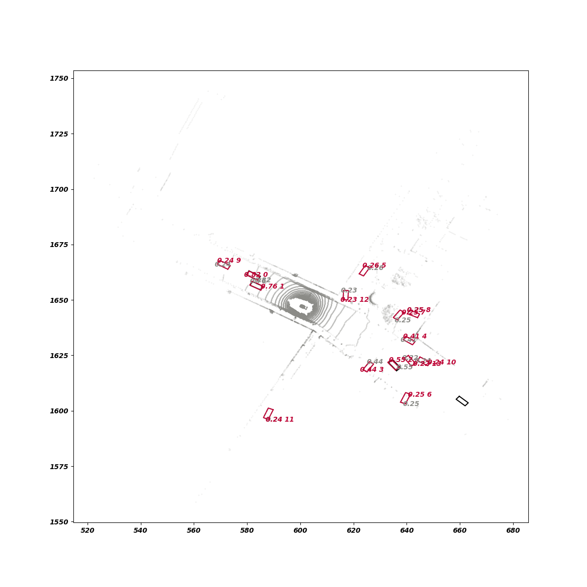
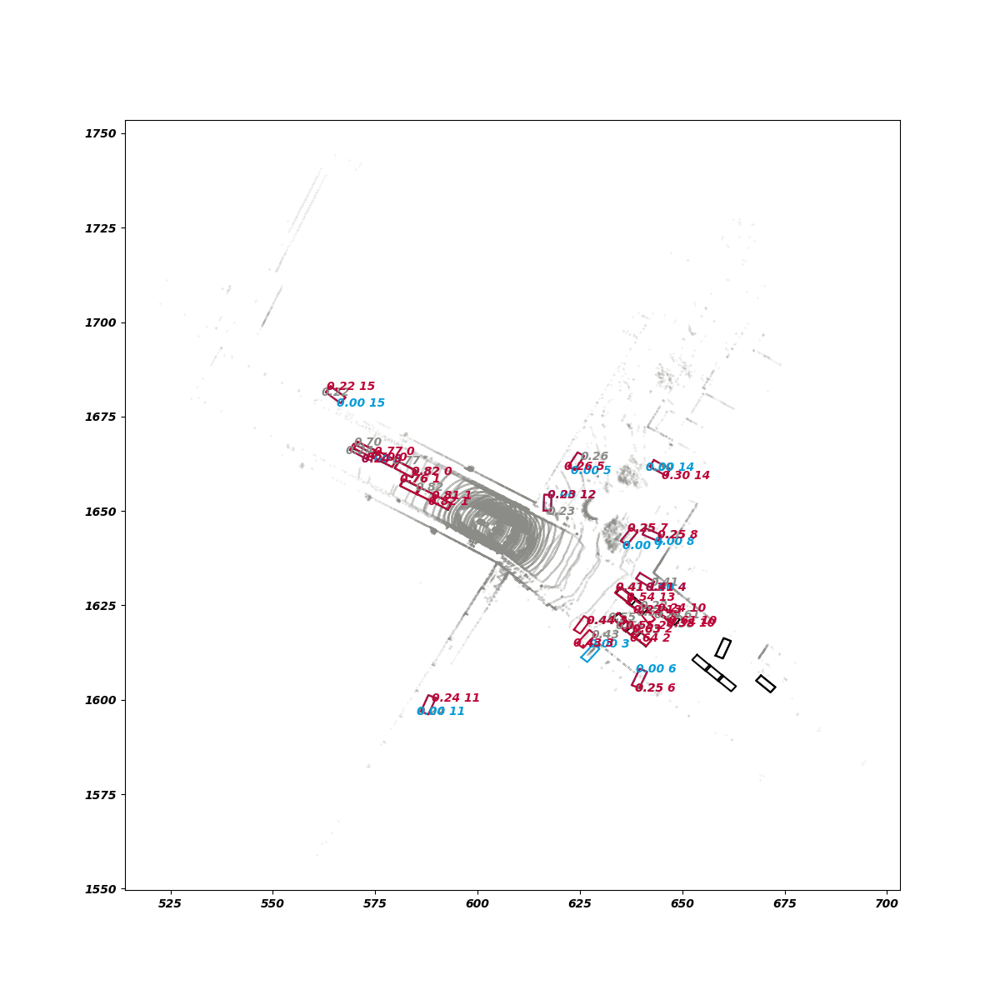
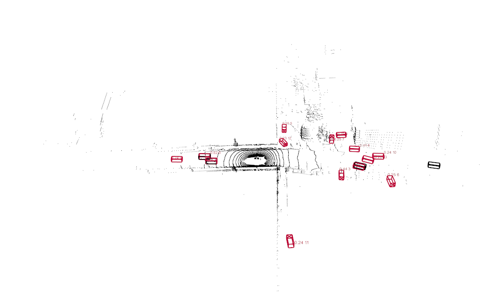
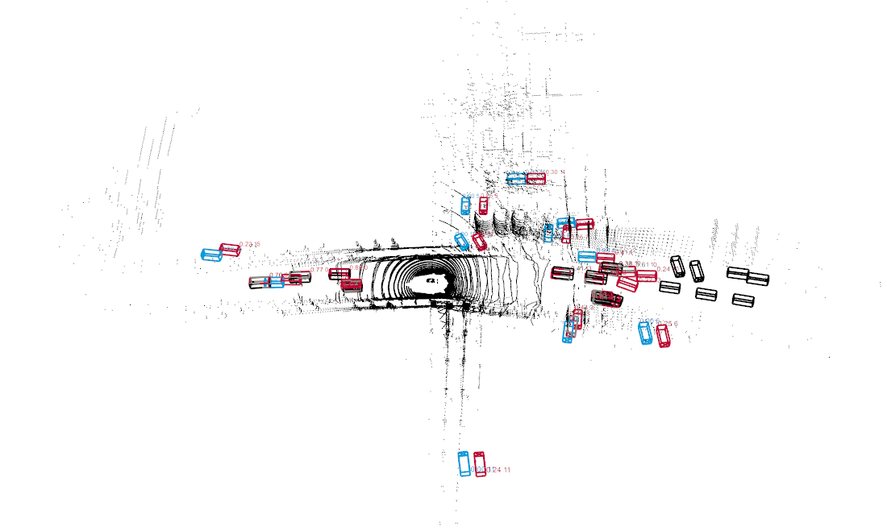

# 1. 2d多帧可视化

- SimpleTrick原始设置

`python tools/main_nuscenes.py --visualize`

- 2d单帧可视化

`python tools/main_nuscenes.py --show_seq --show_frame_nums 1 --obj_types car`

- 2d多帧可视化

`python tools/main_nuscenes.py --show_seq --show_frame_nums 3 --obj_types car`

# 2. 3d多帧可视化

- 3d单帧可视化

`python tools/main_nuscenes.py --show_seq --show_3d --show_frame_nums 1 --obj_types car`

- 3d多帧可视化

`python tools/main_nuscenes.py --show_seq --show_3d --show_frame_nums 3 --obj_types car`

